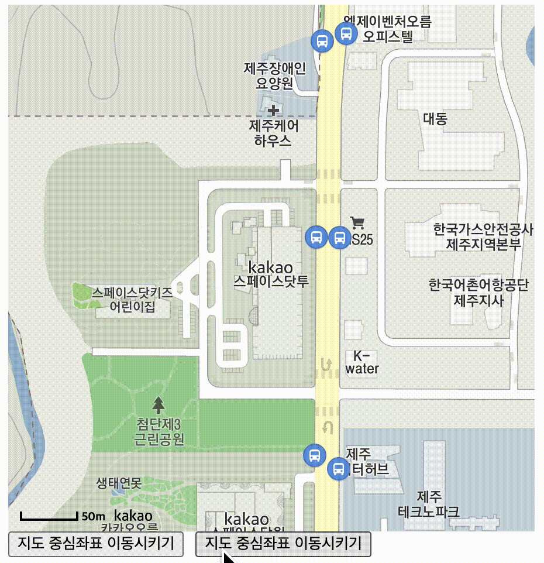

# 개요
카카오 Map API를 이용하여 사용자가 입력한 출발지, 목적지를 표시하고, 경로를 표시하는 기능을 구현하려고 합니다.
모델 시나리오는 아래와 같습니다.

## 모델 시나리오
1. 사용자는 출발지를 설정한다.
    1. 시스템은 지도에 출발지를 표시한다.
2. 사용자는 목적지를 설정한다.
    1. 시스템은 지도에 목적지를 표시한다.
3. 시스템은 사용자의 위치에서 목적지를 가는 경로를 표시한다.

## 카카오 Maps API

[공식문서](https://apis.map.kakao.com/web/guide/#start)에서는 HTML과 자바스크립트를 이용한 방식으로 설명되어 있습니다.
React에서 사용할 수 있도록 변경을 해보도록 하겠습니다.

## 지도 띄우기

**[공식문서내용]**
```html
<script type="text/javascript" src="//dapi.kakao.com/v2/maps/sdk.js?appkey=발급받은 APP KEY를 넣으시면 됩니다."></script>
```

**[public/index.html]**   
카카오맵 API를 로딩하는 스크립트 태그를 root보다 밑의 위치에 넣습니다.
```html
<body>
  <div id="root"></div>
  <script type="text/javascript" src="//dapi.kakao.com/v2/maps/sdk.js?appkey=발급받은 APP KEY를 넣으시면 됩니다."></script>
</body>
```

**[Map.jsx]**   
index.html에서 등록하였기 때문에 window 객체에서 kakao 객체를 가지고 올 수 있습니다. kakao.maps.Map 메서드를 사용하여 지도를 표시할 수 있습니다.   
mapOptions.center로 중심좌표도 이동시킬 수 있겠군요.
```javascript
import React, { useEffect } from 'react';
const {kakao} = window;

const Map = () => {
  
  useEffect(() => {
    const mapContainer = document.getElementById('map'); // 지도를 표시한 곳
    const mapOptions = { // 지도의 옵션
      center: new kakao.maps.LatLng(33.450701, 126.570667), //지도의 중심좌표.
      level: 3 //지도의 레벨(확대, 축소 정도)
    };
    
    const kakaoMap = new kakao.maps.Map(mapContainer, mapOptions);
  }, []);
  

  return (
    <>
      <div
        id="map"
        style={{
          width: "800px",
          height: "800px"
        }}>
      </div>
    </>
  );
};
```
   
짜잔! 이런 아주 심플한 지도가 완성이 되었습니다.    
이제 우리가 원하는 위치로 지도를 이동시키는 방법을 알아보도록 하겠습니다.

## 지도 이동하기
우리는 사용자가 주소를 입력하면 해당 위치로 지도를 이동시키는 기능을 필요로 합니다.   
이 기능을 잘게 쪼개보면 다음과 같습니다.
1. 주소를 입력한다. => 위도, 경도를 입력한다.
2. 해당 위치로 지도를 이동시킨다. => 1번에서 입력한 위도, 경도를 중심점을 갖는 맵을 표시한다.

이렇게 볼 수 있겠군요. 1번 프로세스를 했다고 간주하고 2번 프로세스를 해보도록 하죠.   
버튼을 하나 생성합니다. 그리고 버튼을 누르면 지도를 이동시켜봅시다.

변경되는건 위도, 경도이니 이 친구들을 state로 해서 변경하면 되겠군요.


**[Map.jsx]**   
버튼을 누르면 state.center의 값을 set합니다. useEffect의 dependency를 부여하여 스스로 변경될 수 있도록 합니다.
```javascript
const Map = () => {
  const [state, setState] = useState({
    center: {lat: 33.452613, lng: 126.570888},
  });

  useEffect(() => {
    const mapContainer = document.getElementById('map');
    const mapOptions = {
      center: new kakao.maps.LatLng(state.center.lat, state.center.lng), // 
      level: 3
    };

    const kakaoMap = new kakao.maps.Map(mapContainer, mapOptions);
  }, [state.center.lat, state.center.lng]);
  
  return (
    <>
      <div id="map" style={{width: "800px", height: "800px"}}></div>
      <button onClick={()=>setState({center : {lat: 33.45058, lng: 126.574942}})}>지도 중심좌표 이동시키기</button>
    </>
  )
};
```


짜잔2!! 이렇게 지도의 중심이동을 할 수 있습니다. 그런데 스무스하게 이동하는 느낌보다는 벅벅 거리는 느낌이네요.   
부드럽게 이동하는 방법을 찾아봐야겠습니다.

## 부드럽게 지도 이동하기
먼저 공식문서에 있는 지도 이동시키기를 보도록 하겠습니다.
> 지도 객체의 메소드를 통해 지도를 원하는 좌표로 이동시킬 수 있습니다.   
> 또, 지도가 표시되고 있는 영역크기를 벗어나지 않는 거리라면 애니메이션 효과처럼 지도를 부드럽게 이동시킬 수 있습니다.

지도 객체라.. 코드를 봐야 감이 잡힐듯합니다.

**[공식문서]**
```javascript
var mapContainer = document.getElementById('map'), // 지도를 표시할 div 
    mapOption = { 
        center: new kakao.maps.LatLng(33.450701, 126.570667), // 지도의 중심좌표
        level: 3 // 지도의 확대 레벨
    };

var map = new kakao.maps.Map(mapContainer, mapOption); // 지도를 생성합니다

function setCenter() {            
    // 이동할 위도 경도 위치를 생성합니다 
    var moveLatLon = new kakao.maps.LatLng(33.452613, 126.570888);
    
    // 지도 중심을 이동 시킵니다
    map.setCenter(moveLatLon);
}

function panTo() {
    var moveLatLon = new kakao.maps.LatLng(33.450580, 126.574942);
    
    // 지도 중심을 부드럽게 이동시킵니다
    map.panTo(moveLatLon);            
} 
```
map 객체의 메서드를 이동하는 군요. 공식문서의 setCenter 함수와 panTo 함수를 버튼의 onClick 이벤트로 설정하면 되겠네요.
하지만 문제는 우리의 코드에는 map 객체가 useEffect 안에 있기 때문에 각 함수들을 map을 알 수가 없습니다.
그럼 어떻게 해야할까요?

> React에서 값이 변하는 것은 State!

우리는 map 객체가 변한다는 사실을 알고 있습니다. 그렇다면 map 객체를 state로 하면 되겠군요. 반영해보도록 하겠습니다.

**[Map.jsx]**   
버튼의 onClick 이벤트에 setCenter함수와 panTo함수를 호출하는 방식을 사용했습니다. 각 함수에 이동해야하는 좌표를 파라미터로 넘겼습니다.
```javascript
const Map = () => {
  const [map, setMap] = useState(null);

  useEffect(() => {
    const mapContainer = document.getElementById('map');
    const mapOptions = {
      center: new kakao.maps.LatLng(33.450701, 126.570667), //지도의 중심좌표.
      level: 3 //지도의 레벨(확대, 축소 정도)
    };

    const kakaoMap = new kakao.maps.Map(mapContainer, mapOptions);
    setMap(kakaoMap);
  }, []);

  function setCenter({lat, lng}) {
    const moveLatLon = new kakao.maps.LatLng(lat, lng);
    map.setCenter(moveLatLon);
  }

  function panTo({lat, lng}) {
    const moveLatLon = new kakao.maps.LatLng(lat, lng);
    map.panTo(moveLatLon);
  }

  return (
    <>
      <div id="map" style={{width: "450px", height: "450px"}}/>
      <div style={{display: "flex", gap: "10px"}}>
        <button onClick={() => setCenter({lat: 33.452613, lng: 126.570888})}>
          지도 중심좌표 이동시키기
        </button>
        <button onClick={() => panTo({lat: 33.45058, lng: 126.574942})}>
          지도 중심좌표 부드럽게 이동시키기
        </button>
      </div>
    </>
  );
}
```
  
오~ 스무스~ 부드럽게 이동을 합니다. 좌표가 입력되면 스무스하게 이동시킬 수 있겠습니다. (단, 지도범위를 벗어나지 않는다면요)   
입력창에 좌표를 입력하여 이동하는 것은 다른 단계에서 같이 하도록 하겠습니다.
이제는 지도 상에 특정 좌표를 표시하는 것을 해보죠.

## 지도 위에 마커 표시하기
지도에 올라가는 핀 모양의 이미지를 마커라고 부릅니다. 우리는 출발지, 목적지를 마커로 표시할 겁니다.
먼저 공식문서를 보도록 하지요.

**[공식문서]**   
marker 객체를 생성하여 setMap 메서드의 파라미터에 따라 마커를 표시할 수 있고 제거할 수 있습니다.
```javascript
// map 객체 생성 후
var map = new ...
// 마커가 표시될 위치입니다 
var markerPosition  = new kakao.maps.LatLng(33.450701, 126.570667); 

// 마커를 생성합니다
var marker = new kakao.maps.Marker({
    position: markerPosition
});

// 마커가 지도 위에 표시되도록 설정합니다
marker.setMap(map);

// 아래 코드는 지도 위의 마커를 제거하는 코드입니다
marker.setMap(null);    
```
사용자가 출발지, 목적지를 입력하면 그 좌표에 마커를 보여주는 겁니다. 출발지와 목적지의 marker 객체, 위도, 경도를 담는 state를 생성합니다.   
이 state가 바뀔 때마다 지도에 마커를 marker 객체의 setMap 메서드를 이용하여 map에 표시합니다.

그렇다면 우리 코드에서는 어떻게 적용할 수 있을까요?
잠시 프로세스를 확인해보겠습니다.

1. 사용자가 (출발지 또는 목적지) 주소를 입력한다.
    1. 시스템은 지도의 중심점을 주소의 좌표로 이동시킨다.
    2. 시스템은 마커를 표시한다.
2. 사용자가 주소를 변경한다.
    1. 시스템은 지도의 중심점을 주소의 좌표로 이동시킨다.
    2. 시스템은 기존 마커를 제거한다.
    3. 시스템은 마커를 표시한다.

이 프로세스에 맞춰서 코딩을 해봅시다.

**[Map.jsx]**

```javascript 
const Map = () => {
  const [map, setMap] = useState(null);
  const [pointObj, setPointObj] = useState({
    startPoint: {marker: null, lat: null, lng: null},
    endPoint: {marker: null, lat: null, lng: null}
  });
  
  // 기존 useEffect는 유지합니다.
   
  // pointObj의 변경이 있을 때마다 출발지와 목적지의 marker를 map에 표시해줍니다.
  useEffect(() => {
    for (const point in pointObj) {
      if (pointObj[point].marker) {
        pointObj[point].marker.setMap(map);
      }
    }
  }, [pointObj]);
  
   // 부드럽게 중심점을 이동시키는 메서드만 따로 빼보았습니다.
  function setCenter({lat, lng}) {
    const moveLatLon = new kakao.maps.LatLng(lat, lng);
    map.panTo(moveLatLon);
  }
  
  function setPoint({lat, lng}, pointType) {
    setCenter({lat, lng});
    let marker = new kakao.maps.Marker({position: new kakao.maps.LatLng(lat, lng)});
     setPointObj(prev => {
        if (pointObj[pointType].marker !== null) {
          // 주소가 변경되었을 때 기존 marker를 제거합니다.
           prev[pointType].marker.setMap(null);
        }
        return {...prev, [pointType]: {marker, lat, lng}};
     });
  }
  return (
    <>
       <div id="map" style={{width: "450px", height: "450px"}}/>
       <div style={{display: "flex", gap: "10px"}}>
          <button onClick={() => setPoint({lat: 33.452613, lng: 126.570888}, 'startPoint')}>
             출발지1 지정
          </button>
          <button onClick={() => setPoint({lat: 33.45058, lng: 126.574942}, 'endPoint')}>
             목적지1 설정
          </button>
       </div>
    </>
  )
}
```
공식문서를 참고하여 marker 객체를 생성할 때 출발지와 목적지의 마커를 다르게 하면 더 보기 좋을 것 같습니다.   
해당 코드는 레파지토리에 가서 확인하시기 바랍니다.
우리는 지금까지 많은 기능들을 구현했습니다. 거의 다 왔군요. 이제 이 프로젝트의 꽃인 경로표시를 해보도록 하겠습니다.

## 경로표시하기 (폴리라인 만들기)
우리는 출발지부터 목적지가 까지는 가는 경로를 지도 위에 표시할 겁니다.   


노란색 선처럼 지도 위에 선을 그리는 것을 폴리라인이라고 부릅니다.   
폴리라인은 점과 점을 이어서 선으로 표시합니다. 먼저 공식문서를 보고 설명을 이어가도록 하죠.

**[공식문서]**
```javascript
// 선을 구성하는 좌표 배열입니다. 이 좌표들을 이어서 선을 표시합니다
var linePath = [
    new kakao.maps.LatLng(33.452344169439975, 126.56878163224233),
    new kakao.maps.LatLng(33.452739313807456, 126.5709308145358),
    new kakao.maps.LatLng(33.45178067090639, 126.5726886938753) 
];

// 지도에 표시할 선을 생성합니다
var polyline = new kakao.maps.Polyline({
    path: linePath, // 선을 구성하는 좌표배열 입니다
    strokeWeight: 5, // 선의 두께 입니다
    strokeColor: '#FFAE00', // 선의 색깔입니다
    strokeOpacity: 0.7, // 선의 불투명도 입니다 1에서 0 사이의 값이며 0에 가까울수록 투명합니다
    strokeStyle: 'solid' // 선의 스타일입니다
});

// 지도에 선을 표시합니다 
polyline.setMap(map); 
```
linePath 좌표 배열을 이용하여 polyline 객체를 생성합니다. 그리고 setMap 메서드로 지도 위에 표시합니다.   
linePath 좌표 배열의 각 요소는 좌표로 이루어져있군요. 또한 kakao.maps.Polyline의 옵션에서 선을 정의할 수도 있습니다.

그럼 linePath는 어디서 받아야 할까요? 출발지와 목적지로만 구성을 할 수 있을까요?   
그렇게 된다면 출발지와 목적지를 직선으로 이어버릴 겁니다. 경로가 비행기라면 가능하겠네요 😅

길찾기 기능이 있는 지도를 보시면 사람 또는 운행수단이 이동할 수 있는 경로를 보여줍니다.   
예를 들어, 현재 위치에서 목적지를 가는 방법이 편의점 앞에서 좌회전이라고 해보죠. 좌표 배열은 아래와 같이 나올 것입니다.
```javascript
var linePath = [
   현재 좌표,
   편의점 좌표,
   목적지 좌표
];
```
이렇게 되면 현재 좌표에서 편의점 좌표까지 선을 긋고 편의점 좌표에서 목적지 좌표까지 선을 이어버립니다. 그럼 경로로 표시가 되겠군요.

우리는 이제 길찾기 API를 이용하여 출발지에서 목적지까지 가는 경로(좌표 배열)을 구하면 됩니다.   
카카오맵이니까 카카오모빌리티에서 제공하는 API를 사용해보겠습니다.

## 카카오모빌리티 자동차 길찾기 API

카카오모빌리티 자동차 길찾기 API의 [공식문서](https://developers.kakaomobility.com/docs/navi-api/directions/)를 확인해보겠습니다.

대부분 API 공식문서는 아래와 같이 구성됩니다.
- 호출방식 : Method(GET, POST 등), URL
- 요청헤더 : Authorization(API 키), Content-Type
- 요청파라미터 : name=요청값 (필수도 있고 선택도 있음)

꼭 요청 코드 예제를 확인하시기 바랍니다. ( 사용하다보면 아~~~ 하게 됩니다 )

**[Map.jsx]**   
경로 구하기 버튼에 생성합니다. 버튼에 onClick 이벤트를 설정하고 콜백함수로 아래 함수를 할당합니다.
```javascript
  async function getCarDirection() {
    const REST_API_KEY = 'REST_API_KEY';
    // 호출방식의 URL을 입력합니다.
    const url = 'https://apis-navi.kakaomobility.com/v1/directions';

   // 출발지(origin), 목적지(destination)의 좌표를 문자열로 변환합니다.
    const origin = `${pointObj.startPoint.lng},${pointObj.startPoint.lat}`; 
    const destination = `${pointObj.endPoint.lng},${pointObj.endPoint.lat}`;
    
    // 요청 헤더를 추가합니다.
    const headers = {
      Authorization: `KakaoAK ${REST_API_KEY}`,
      'Content-Type': 'application/json'
    };
  
    // 표3의 요청 파라미터에 필수값을 적어줍니다.
    const queryParams = new URLSearchParams({
      origin: origin,
      destination: destination
    });
    
    const requestUrl = `${url}?${queryParams}`; // 파라미터까지 포함된 전체 URL

    try {
      const response = await fetch(requestUrl, {
        method: 'GET',
        headers: headers
      });

      if (!response.ok) {
        throw new Error(`HTTP error! Status: ${response.status}`);
      }

      const data = await response.json();
      
      console.log(data)
    } catch (error) {
      console.error('Error:', error);
    }
  }
```
먼저 data가 어떻게 내려오는지 확인해볼까요?   
두근두근한 마음으로 출발지와 목적지를 설정하고 버튼을 누르면 공식문서의 응답코드 예제처럼 나오면 성공입니다.      
성공하셨다면 반환된 data와 공식문서의 응답 객체를 비교하면서 어떤 정보가 반환되는지 꼭 확인하세요.

이 프로젝트에서는 대안 경로 제공 여부(alternatives)를 미제공으로 하였고 경유지를 설정하지 않았습니다.   
그래서 data.routes의 길이는 1이고, data.routes[0].sections도 길이가 1입니다.   
data.routes[0].sections[0] 배열의 구성요소를 보면 roads(도로정보), guides(안내정보) 안에 우리가 원하는 정보가 있을 것 같군요.   
확인을 해보니까 guides(안내정보) 안에 있는 x, y로 폴리라인을 구성하면 건물 위로 지나다니더군요. 아무래도 아닌 것 같습니다.

ata.routes[0].sections[0].roads.vertexes 배열을 정리를 해보면 될 듯합니다.

**[Map.jsx getCarDirection 함수 안]**
```javascript
  // const data = await response.json();

  const linePath = [];
  data.routes[0].sections[0].roads.forEach(router => {
    router.vertexes.forEach((vertex, index) => {
       // x,y 좌표가 우르르 들어옵니다. 그래서 인덱스가 짝수일 때만 linePath에 넣어봅시다.
       // 저도 실수한 것인데 lat이 y이고 lng이 x입니다.
      if (index % 2 === 0) {
        linePath.push(new kakao.maps.LatLng(router.vertexes[index + 1], router.vertexes[index]));
      }
    });
  });
  var polyline = new kakao.maps.Polyline({
    path: linePath,
    strokeWeight: 5,
    strokeColor: '#000000',
    strokeOpacity: 0.7,
    strokeStyle: 'solid'
  }); 
  polyline.setMap(map);
```
짜잔3!


이렇게 검은색으로 선이 그려졌다면 제대로 한 것입니다. 👏👏👏 옵션을 바꾸어서 원하는대로 변경할 수 있습니다.   
getCarDirection 함수에서 출발지와 목적지가 설정이 되지 않았다면 바로 return 될 수 있도록 하는 것도 좋을 듯합니다.


## 추가로 적용하면 좋을 것들

이 글에서는 설명하지 못했지만 추가적으로 아래 기능을 추가하려고 합니다.
1. 사용자가 주소를 입력하는 기능 : 주소를 입력 받으면 좌표로 변환하기
2. 리셋기능 : 경로 구하기 후 출발지 또는 목적지가 변경되었을 때 기존 폴리라인 삭제 후 다시 폴리라인를 지도에 표시
3. 출발지, 목적지 마커 변경
4. 경로가 표시되고 있는 지도범위를 벗어났을 경우 : 길찾기 API의 응답값 중에 모든 경로를 포함하는 바운딩 박스에 맞춰서 지도 영역 변경 (공식문서의 지도 범위 재설정 하기 참고)


# 마무리
카카오 지도 API와 카카오 모빌리티 길찾기 API를 이용하여 좌표와 경로를 표시해 보았습니다. 그래도 회사 프로젝트를 통해 경험한 적이 있어서 그런지 겁이 나지 않더군요.   
마커, 인포윈도우, 폴리라인 객체를 생성하고 Map 객체의 메서드를 이용하여 지도에 표시하는 방식은 Google Maps API도 이와 비슷합니다. 다른 지도 API도 비슷하겠죠. 🤣

더 좋은 글로 다시 인사드리겠습니다.


