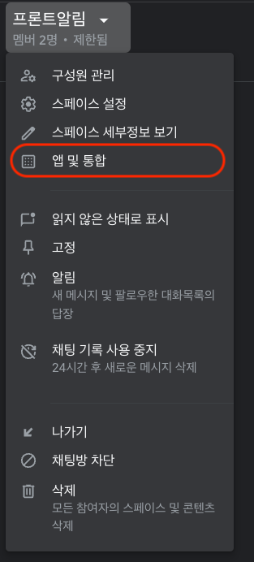
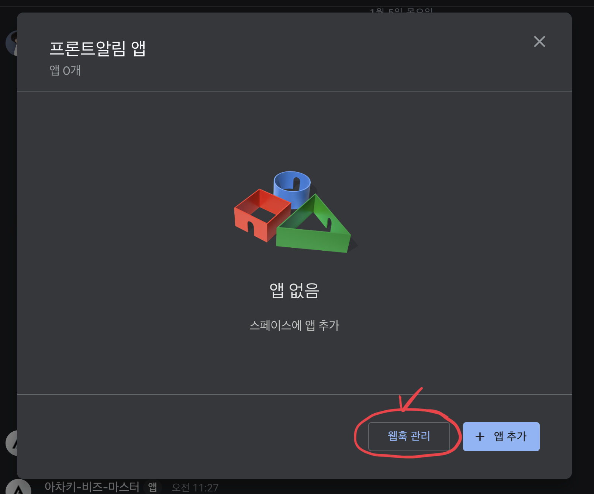
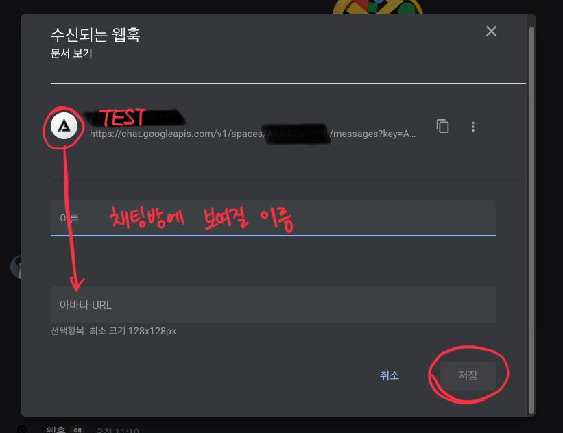
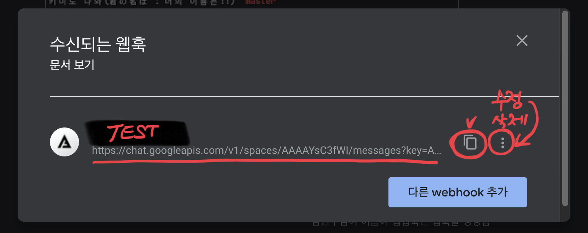
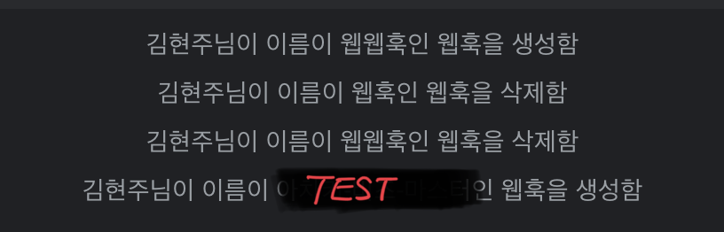

여러분이 작업한 프로젝트를 배포하는 과정에서 다른 팀원들에게 알리고 싶다면 어떻게 해야 할까요? 다양한 메시지를 통하여 알림을 보낼 수가 있습니다.    
제가 다니는 회사가 Slack(슬랙)을 이용하다가 이제는 Google Chat(구글 챗)을 사용하게 되었습니다. 마이그레이션하는 과정에서 알게된 쉘 스크립트를 이용해 배포 알림을 보내는 방법을 소개하겠습니다.

## 1. Google Chat Webhook URL 설정하기

Google Chat에서 알림을 받으려면 먼저 webhook URL을 설정해야 합니다. Webhook URL은 Google Chat에서 제공하는 고유한 주소로, 이 주소로 메시지를 보내면 Google Chat에
알림이 표시됩니다. Google Chat에서 새로운 webhook URL을 생성하는 방법은 다음과 같습니다.

1. Google Chat의 대화방에 들어갑니다.

2. 채팅방 좌측 상단에 있는 설정에서 “앱 및 통합”을 선택합니다.
   

3. 팝업창이 나오면 "웹훅 추가"를 클릭합니다.
   


4. 채팅방에 나오게 될 웹훅 이름과 아이콘을 설정한 후 "저장"을 클릭합니다. 저는 TEST라는 이름을 사용해서 사용할 예정입니다.
   

5. 이렇게 생성된 webhook URL을 복사합니다.
   

   주소는 ```https://chat.googleapis.com/v1/spaces/스페이스이름/messages?key=yyyyy&token=zzzzz```
   와 유사한 형식을 가지게 됩니다. 웹훅의 이름, 아이콘을 수정하거나 삭제할 수 있습니다.

   > 화면의 주소와 여러분의 주소가 다를 수 있습니다.

6. webhook을 생성하면 채팅방에 알림이 가게 됩니다.
   

## 2. 쉘 스크립트 작성하기

- 복사한 webhook URL을 사용하여 쉘 스크립트를 작성해 봅시다. 쉘 스크립트는 간단한 쉘 명령어를 통해 운영 체제에 명령을 내리는 스크립트입니다.   
  추가적으로 사용자의 이름을 넣는 기능까지 추가해보았습니다.

    ```bash
    #!/bin/bash
    
    # 사용자 이름을 가져옵니다.
    NAME="홍길동"
    
    # Google Chat webhook URL 설정
    GOOGLE_CHAT_WEBHOOK_URL="복사한 webhook URL"
    
    # 프로젝트 이름을 변수로 설정합니다.
    PROJECT="프로젝트이름"
    
    # 메시지 내용 생성 (사용자 이름 포함)
    # 나중에 내용을 변경하셔도 됩니다.
    MESSAGE="${NAME}님께서 ${PROJECT}의 배포를 시전하였습니다."
    
    # 메시지의 JSON 포맷 생성
    # 혹시나 적용이 되지 않는다면 가장 바깥의 쌍따옴표("")를 홑따옴표('')로 변경하세요. 
    json_message="{"text": "'"${MESSAGE}"'"}"
  
    
    # 메시지를 Google Chat으로 전송
    curl -X POST \
         -H 'Content-Type: application/json' \
         -d "$json_message" \
         "$GOOGLE_CHAT_WEBHOOK_URL"
    ```

  이 스크립트는 다음과 같은 과정을 거칩니다.

    - 사용자 이름을 변수에 저장합니다.
    - 앞서 설정한 Google Chat webhook URL을 변수에 저장합니다.
    - 프로젝트 이름을 변수로 설정합니다.
    - 메시지 내용을 생성합니다. 여러분이 원하시는 문구를 적어주시면 됩니다.
    - 이를 JSON 포맷으로 변환합니다. 여기서는 사용자 이름과 함께 배포 알림 메시지를 구성하였습니다.
    - `curl` 명령어를 사용하여 메시지를 Google Chat webhook URL로 전송합니다. 글 마지막에 추가 설명하도록 하겠습니다.
    - 모든 과정이 끝나면 터미널에 실행 결과가 나옵니다.

## 3. 쉘 스크립트 실행하기

- 스크립트를 실행하기 위해서는 파일에 실행 권한을 부여해야 합니다. 터미널에서 다음 명령어를 입력하여 스크립트 파일에 실행 권한을 부여합니다.

    ```bash
    # 해당 Bash 스크립트가 있는 폴더
    
    chmod +x deploy_notification.sh
    ```

  > 실행권한이 없이도 실행이 가능할 수 있습니다.


- 이제 스크립트를 실행할 준비가 되었습니다. 터미널에서 다음 명령어를 입력하여 스크립트를 실행해 보세요.

    ```bash
    # 해당 Bash 스크립트가 있는 폴더
    
    ./deploy_notification.sh
    ```

- 스크립트가 정상적으로 실행되면 Google Chat의 대화방에 배포 알림이 표시됩니다.
  
  > 여러분이 정하신 웹훅의 이름과 NAME, PROJECT, MESSAGE에 따라 다르게 표시될 수 있습니다.


이 방법을 사용하면 팀원들에게 프로젝트의 배포 상황을 쉽게 공유할 수 있습니다. 원하는 경우에는 스크립트를 수정하여 보다 다양한 정보를 알림으로 전송할 수도 있습니다. 이제 여러분도 Google Chat을 활용하여
프로젝트의 소통을 한층 더 강화해 보세요!

## 추가 팁: 쉘 스크립트를 확장하여 더 많은 정보 전달하기

이제 기본적인 배포 알림을 전송하는 방법을 배웠으니, 스크립트를 확장하여 더 많은 정보를 알림으로 전달하는 방법에 대해 알아봅시다.

- 배포 날짜와 시간 추가하기

  배포 날짜와 시간을 알림에 추가하려면, 스크립트에 다음 코드를 삽입합니다.

    ```bash
    # 현재 날짜와 시간을 가져옵니다.
    CURRENT_TIME=$(date +"%Y-%m-%d %H:%M:%S")
    
    # 메시지 내용에 날짜와 시간을 포함합니다.
    MESSAGE="${NAME}님께서 ${PROJECT}의 배포를 시전하였습니다. (배포 시간: ${CURRENT_TIME})"
    ```

- 메시지 형식 추가하기

  Google Chat은 단순한 텍스트 뿐만 아니라 볼드체, 이탤릭체, 링크, 블록 인용 등 다양한 형식의 메시지를 지원합니다. 다음은 볼드체를 사용하여 메시지 형식을 변경한 예입니다.

    ```bash
    # 메시지 내용에 날짜와 시간을 포함합니다.(볼드체 사용)
    MESSAGE="${NAME}님께서 *${PROJECT}*의 배포를 시전하였습니다. (배포 시간: ${CURRENT_TIME})"
    ```

## 추가 설명 : curl

`curl`은 커맨드라인에서 사용하는 데이터 전송 도구로, URL을 이용해 다양한 프로토콜(HTTP, HTTPS, FTP, SMTP 등)을 사용하여 데이터를 주고받을 수 있습니다. 주로 웹 API와 상호작용할 때
유용하게 사용됩니다.

스크립트에서 사용된 `curl` 명령어를 분석해 보겠습니다.

```bash
curl -X POST \
     -H 'Content-Type: application/json' \
     -d "$json_message" \
     "$GOOGLE_CHAT_WEBHOOK_URL"
```

위의 `curl` 명령어는 다음과 같은 옵션을 사용합니다.

- `-X POST`: `-X` 옵션은 사용할 HTTP 메서드를 지정합니다. 여기서는 POST 메서드를 사용하므로 `-X POST`를 사용합니다.
- `-H 'Content-Type: application/json'`: `-H` 옵션은 HTTP 헤더를 설정할 수 있습니다. 여기서는 JSON 형식의 데이터를
  보내므로 `Content-Type: application/json`으로 설정합니다.
- `-d "$json_message"`: `-d` 옵션은 POST 요청 시 보낼 데이터를 지정합니다. 여기서는 JSON 형식의 메시지를 전송하므로, 앞서 생성한 `json_message` 변수를 사용합니다.
- `"$GOOGLE_CHAT_WEBHOOK_URL"`: 마지막으로, 요청을 보낼 URL을 지정해야 합니다. 여기서는 Google Chat의 webhook URL을 사용하므로, 앞서
  설정한 `GOOGLE_CHAT_WEBHOOK_URL` 변수를 사용합니다.

이렇게 구성된 `curl` 명령어가 실행이 완료가 되면 실행 결과를 터미널에 출력합니다. 몇십줄의 결과가 출력되는데 출력하지 않도록 설정할 수도 있습니다.

```bash
curl -s -o /dev/null -X POST \
     -H 'Content-Type: application/json' \
     -d "$json_message" \
     "$GOOGLE_CHAT_WEBHOOK_URL"
```

위에 `curl` 명령어는 다음과 같은 옵션이 추가되었습니다.

- `-s`: 실행 결과를 터미널에 출력하지 않도록 설정합니다. 이 옵션은 "silent"의 약자로, `curl` 명령어의 실행 과정 중 진행 상황이나 에러 메시지를 터미널에 출력하지 않습니다.
- `-o /dev/null`: 실행 결과를 `/dev/null` 파일에 저장하도록 설정합니다. `/dev/null`은 UNIX 및 Linux 시스템에서 사용되는 가상의 파일로, 이 파일로 보내진
  데이터는 모두 무시됩니다. 이 옵션을 사용함으로써, 실행 결과를 파일로 저장하면서 터미널에는 출력하지 않습니다.
