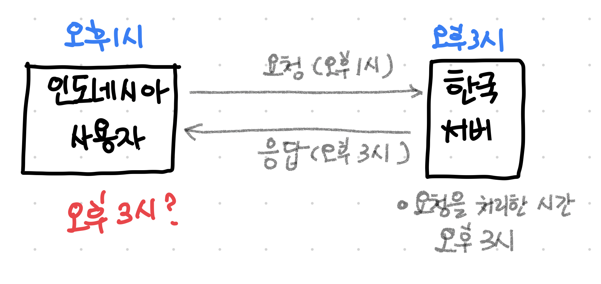
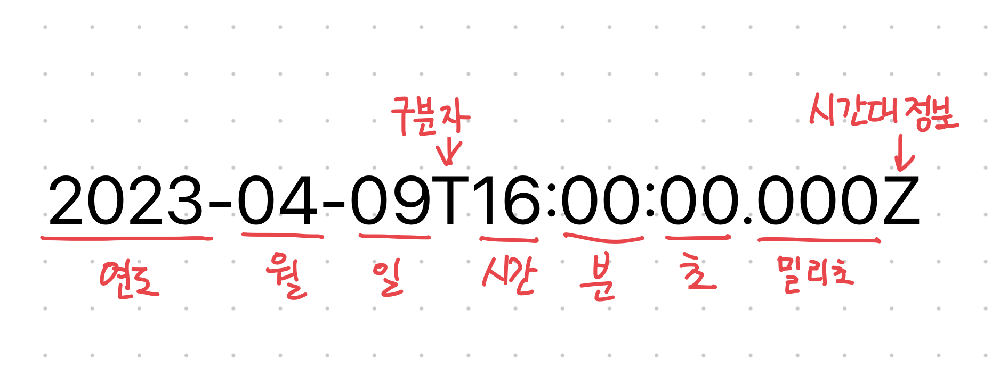

가입한 날짜, 수정한 날짜, 또는 남은 시간등을 표시할 때 시간표시를 많이 합니다. 개발을 막 시작했을 때는 그냥 표시하면 되지라는 생각을 했는데 이번 회사를 다니면서 ‘시간’이라는 개념을 다시 생각하게 되었습니다.

회사에서 해외서비스를 진행하면서 저에게는 신기한 경험을 하게 되었습니다.

인도네시아는 우리나라와 2시간의 시차가 있습니다. ( 2시간 느립니다 ) 웹사이트에서 단순하게 인도네시아의 사용자의 시간을 보여주는 것은 문제가 되지 않습니다. 서버에서 데이터를 언제 가지고 왔는지에 대한 시간을 보여주는 것은 문제가 되지 않습니다.

문제는 서버의 데이터를 가지고 올 때가 되는거죠.

아래 삐뚤빼뚤한 이미지를 보시면 이해가 될 것입니다.


인도네시아 사용자가 무언가를 등록하면 한국서버는 한국시간으로 저장을 하면 시차가 발생한 시간을 저장하고, 다시 사용자에게 한국시간으로 저장된 시간을 보여줄 것입니다.

여기서 의문을 가질 수 있습니다.

**그냥 사용자의 시간을 서버로 보내주고 서버가 저장하면 안될까요?**


**네. 안되요.**

보내도 됩니다. 나쁘지 않은 생각이죠. 우리 어릴적에 게임할 때 시간 바꾸어서 리세마리 했던 기억이 나시는지요…? (프린세스메이커 dd파일과 같은?!) 이렇게 사용자는 시간대를 마음대로 변경할 수 있습니다. 그래서 이 방법은 권장하지 않습니다. 그러면 어떤 방법을 간구할 수 있을까요?

서버와의 시간을 맞추는 겁니다. 어디든지 한국시간으로 보내주세요, 어디든지 어떤 시간으로 보내주세요.를 정하는 거지요. 그럼 **어떤 시간**에 **어떤 표현**을 할 것인지 알아보도록 하겠습니다.

# 시간대

어디 기준이라 생각하시면 편합니다.

### UTC (협정 세계표준시)

UTC(Coordinated Universal Time)는 전 세계적으로 기준 시간 단위로 사용되는 시간 표준입니다. 그것은 지구의 자전 측정을 기반으로 하며 매우 정확한 원자 시계와 동기화됩니다.

### GMT(그리니치 표준시)

GMT(그리니치 표준시)는 세계 일부 지역에서 기준 시간으로 사용되는 시간대입니다. 경도 0도에 위치한 영국 런던의 그리니치에 있는 왕립 천문대의 평균 태양시를 기준으로 합니다.

두 시간대는 비슷하지만 현재는 UTC를 더 많이 사용합니다.

# 시간 표기법

우리는 일상생활에서도 다양한 시간 표기법을 사용합니다.

2023년 04월 09일 오후 4시 = 2023-04-09 16:00 = 2023-04-09 오후 04:00

같은 시간을 다른 방식으로 표기했습니다. 이제 표기하는 방법을 알아보도록 하겠습니다.

### **1. 유닉스 시간(Unix Time) 또는 에폭시 시간(Epoch Time)**

유닉스 시간은 1970년 1월 1일 0시 0분 0초(UTC)부터 경과된 시간을 초 단위로 표현한 것입니다. 유닉스 운영체제에서 처음 도입되었으며, 현재까지 널리 사용되고 있습니다. 유닉스 시간은 숫자로만 이루어져 있기 때문에 계산이 간편하고, 시간대의 변화나 서머타임(Daylight Saving Time) 등을 고려하지 않아도 됩니다.

시간(Time) 대신 타임스탬프(Timestamp)라는 단어를 사용하기도 합니다.

4월 9일 오후 2:30:45 UTC"의 Unix 시간은 1699609045입니다.

### 2. ISO 8601

국제 표준화 기구(International Organization for Standardization)에서 제정한 날짜와 시간 표기법입니다. 이 표기법은 문자열 형태로 날짜와 시간을 표현하며, 각 항목이 숫자로 구성되어 있어 가독성이 높고, 전 세계적으로 통용되는 방식입니다.

이제 시간대와 표기법에 대해서 알아보았으니 어떻게 시간을 맞추는지 알아보겠습니다.


# 서버와 시간 맞추기

클라이언트에서 UTC시간대로 변환해서 서버로 보내주면 서버는 그대로 DB에 저장을 해주면 됩니다.

거꾸로 빼올 때는 서버는 DB에서 데이터를 가지고 와서 그대로 클라이언트로 보내주면 됩니다.

표기법에 따라 자바스크립트에서 변환하는 방법을 알아보겠습니다.

### 1. ISO 8601로 표기해서 보내기

자바스크립트의 `new Date()`는 현재 시간을 나타내지만 엄격한 ISO 8601 형식을 따르지 않습니다. 그러므로 생성한 시간을 `toISOString()`으로 문자열로 변환을 합니다.
```js
const currentTime = new Date() // Sun Apr 09 2023 17:00:00 GMT+0900 (한국 표준시)
const utcTime = currentTime.toISOString() // 2023-04-09T08:00:00.000Z
```

### 2. 타임스탬프로 보내기

`new Date()`를 통해서 생성한 시간을 `getTime()`을 이용해서 타임스탬프로 변환을 합니다.

```js
const currentTime = new Date() // Sun Apr 09 2023 17:00:00 GMT+0900 (한국 표준시)
const timestamp = currentTime.getTime() // 1681027200000
```

### 3. 받은 시간 표시하기

서버에서 받은 시간을 표기할 때는 `new Date('받은시간')`을 하면 시간을 확인할 수 있습니다.

ISO 8601 형식이나 타임스탬프 형식 모두 동일합니다.

```js
const dataTime = new Date('받은시간') 
// Sun Apr 09 2023 17:00:00 GMT+0900 (한국 표준시)
```


# 마치며
이 사이트를 통해서 실제 시간이 어떻게 변화되는지 확인해보시기 바랍니다.
https://www.epochconverter.com/

어떤 표기법이 더 좋다. 어떤 시간대가 더 좋다고는 확언할 수 없습니다.
제일 중요한 것은 서버 개발자와 많은 대화를 하셔서 정하시면 됩니다.
그게 정답인 것 같습니다. ;)
