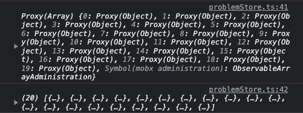

이번에 면접 과제를 진행하면서 MobX를 처음 써보았습니다. [MobX 공식문서](https://ko.mobx.js.org/)와 유튜브 강의를 보면서 구현해 보았는데 과연 내가 제대로 사용하는가가 궁금해졌습니다. 그래서 다시 공식문서를 보면서 복기하고 리팩토링을 해보려고 합니다.

✅ 과제 코드가 외부에 공개될 수도 있으므로 공식문서에 나온 예제로 예시를 보여드립니다.

## 1. Observable State 만들기

### `class + makeObservable`

저는 이 방식으로 구현했습니다. 강의나 공식문서에서 많이 등장하였고 공식문서 내의 [클래스에 대한 짧은 참고자료](https://ko.mobx.js.org/observable-state.html#%ED%81%B4%EB%9E%98%EC%8A%A4%EC%97%90-%EB%8C%80%ED%95%9C-%EC%A7%A7%EC%9D%80-%EC%B0%B8%EA%B3%A0%EC%9E%90%EB%A3%8C)을 읽고 typescript와 객체지향 프로그래밍을 시도하기 위해서 이 방식으로 선택했습니다.

```ts
// class.ts
import { makeObservable, observable, computed, action, flow } from "mobx"  

export class Doubler {  
	list: List[] = []
	sortType : string = DEFAULT_SORT_TYPE
	
	constructor() {  
		makeObservable(this, {  
			list: observable,
			sortType: observable,
			getTotalListCount: computed,  
			setDefaultSortType: action,  
		})  
	}  
  
	get getTotalListCount() {  
		return this.list.length;  
	} 
  
	setDefaultSortType() {  
		this.sortType = DEFAULT_SORT_TYPE;
	}  
}
```
> 공식문서의 Proxy 객체로 감싸지지 않는다고 하였는데 클래스 내부의 상태가 배열일 경우에는 Proxy 객체로 감싸져있더군요. 이번에 글을 작성하면서 `toJS(value)` 메서드를 알게되었습니다. 메서드를 사용하면 Proxy 객체로 wrapping 되어 있지 않습니다.
>
>
> 

### `makeAutoObservable`

`factory function + makeAutoObservable` 방식입니다.  공식문서의 탭에서 예제를 확인해보실 수 있습니다. 마치 typescript의 타입 추론처럼 알아서 모든 속성(property)을 기본적으로 추론합니다.

> 속성(property)과 행동(action)은 MobX에서 다른 개념입니다.
> 위 코드의 `list`, `sortType`을 속성이라고 하고 `setDefaultSortType`을 행동이라고 합니다.

### `observable`

`obsevable` 방식입니다. 객체에 필드를 추가거나 제거를 할 수 있습니다. 아래 코드처럼 사용할 수 있습니다.

```ts
const todosById = observable({  
	"TODO-123": {  
		title: "find a decent task management system",  
		done: false  
	}  
})  
  
todosById["TODO-456"] = {  
	title: "close all tickets older than two weeks",  
	done: true  
}
```

> 간단한 프로젝트에서는 사용하기 좋을 듯하나 프로젝트의 크기가 커지면 상태를 어디서 어떻게 바꾸었는지 찾는데 오래 걸릴 듯합니다.

### 결론 : 접근 방식은 모두 유효하다.

다만 프로젝트의 복잡성과 크기, 컨셉에 따라 사용 방식을 다르게 하는 것이 좋을 듯합니다.


## 2. action을 이용한 state 업데이트

### makeObservable

클래스를 정의할 때 action을 선언해야 합니다. 다만 action은 state를 수정하려는 함수에서만 사용해야 합니다.
또, 제가 생각하는 클래스를 이용한 상태관리는 UI 컴포넌트에서 직접 상태를 수정하면 안됩니다. 클래스 내부의 메서드를 통해서 상태가 수정되어야 한다고 생각합니다.

```ts
// ✅ 좋은 예 
// Doubler 클래스 내부
setDefaultSortType() { // action 선언 후
	this.sortType = DEFAULT_SORT_TYPE;
}

// UI 컴포넌트
const sortTypeHandler = () => {
	boubler.setDefaultSortType()
}

// ❌ 나쁜 예
// UI 컴포넌트 : 직접 상태 값에 접근
const sortTypeHandler = () => {
	boubler.sortType = DEFAULT_SORT_TYPE;
}
```

### `action` 함수를 이용한 함수 래핑

```tsx
// 내가 사용한 방식
return (
	<button onClick={action(() => sortTypeHandler())}>리셋</butoon>
)

// action 함수 wrapping

return (
	<button onClick={action(() => sortTypeHandler())}>리셋</butoon>
)
```

MobX의 트랜잭션 특성을 최대한 활용하려면 action을 최대한 외부로 전달해야 합니다. 여기서 이야기하는 트랜잭션 특성이란 관찰 가능한 여러 상태 변경을 단일 작업으로 일괄 처리하는 기능을 나타냅니다. 이로 인해 얻을 수있는 이득은 다음과 같습니다.

1. 작업이 여러 상태 변경을 트리거하는 경우 MobX는 이러한 모든 변경 사항을 함께 그룹화하고 단일 원자 작업으로 실행합니다.
2. 개별 상태가 변경된 후가 아니라 트랜잭션이 끝날 때 한 번만 업데이트됩니다. 이는 불필요한 재렌더링을 줄이고 성능을 향상시킵니다.
3. 작업 실행 중에 오류가 발생하면 MobX는 해당 작업 중에 이루어진 모든 변경 사항을 롤백하여 관찰 가능한 상태가 일관되게 유지되도록 합니다.
4. 작업이 다른 작업을 호출하는 경우 중첩된 작업 내에서 변경된 사항은 동일한 트랜잭션의 일부로 처리됩니다. 이는 작업이 서로 구성되거나 호출되는 경우에도 트랜잭션 무결성을 유지하는 데 도움이 됩니다.

> 트랜잭션이란 특성으로 인해 필수적이라고 생각됩니다. 하지만 저의 코드는 단순한 상태변경이 대부분이었습니다. 이로 인한 성능 향상은 미미할 수 있고 불필요한 상용구 코드가 생성될 것입니다.
> 기억해두었다가 성능, 일관성 및 예측 가능성 측면의 처리가 필요하다면 써봐야겠습니다.

### `action.bound`

`this`가 항상 함수 내에서 적절하게 바인딩 될 수 있도록 메서드를 올바른 인스턴스에 바인딩하는 데 사용됩니다.

❗️ 클래스 인스턴스에 상태, 메서드를 구조 분해 할당방식으로 사용하고 싶었습니다. 렌더링에는 문제가 없었는데 리셋버튼을 누르니까 에러가 났습니다. 즉, 컴파일에는 문제가 없었는데 `sortTypeHandler()` 함수를 사용하면 `Uncaught TypeError: Cannot set properties of undefined (setting 'sortType')` 에러메시지가 나왔습니다.
구조 분해 할당을 사용하지 않으면 문제는 없었습니다.

그 때는 '뭐지..?' 하고 넘어갔는데 이제 알게 되었습니다.

```tsx
// 내가 작성한 예 : 결론적으로 나쁜 예시 ❌
// UI 컴포넌트
const { boubler } = useStore();
// const {boubler : { setDefaultSortType }} = useStore();

const sortTypeHandler = () => {
	boubler.setDefaultSortType()
	// 구조 분해 할당으로 메서드를 할당하고 싶었습니다.
	// setDefaultSortType()
}

return (
	<button onClick={() => sortTypeHandler()}>리셋</butoon>
)

// 클래스 내부
	setDefaultSortType: action

	setDefaultSortType() {  
		this.sortType = DEFAULT_SORT_TYPE;
	}  
```

✅ 구조 분해 할당을 사용하기 위한 `this` 바인딩

```javascript
// 클래스 내부
	setDefaultSortType() {  
		this.sortType = DEFAULT_SORT_TYPE;
	} 
	
// UI 컴포넌트
const { boubler : { setDefaultSortType }} = useStore();
const destructuring = useStore().boubelr.setDefaultSortType;

console.log(setDefaultSortType === destructuring) // true

destructuring() // this == undefined
```

자바스크립트의 `this`는 함수의 실행 문맥에 따라갑니다. 이야기하면 길지만 자바스크립트 엔진이 실행 가능한 코드를 만났을 때 `실행 컨텍스트`(Excution Context)를 생성하고 그 과정 중에 this 값을 설정(바인딩)을 합니다.

위의 내용대로라면 변수 `destructuring` 는 클래스 객체가 바인딩이 되어 있는 상태가 아닌겁니다.(참조한다, 가르킨다라는 표현으로 사용도 합니다.)   
기본값인 window 객체로 바인딩이 될 것이지만 출력을 시도하면 undefined가 됩니다.

그래서 컴파일할 때 문제가 없다가 함수를 실행하면 에러가 나는 겁니다. 아이 부끄러워라.😂
(켰을 때는 문제가 없는데 버튼을 누르니까 에러가 나는거죠. )

그럼 어떻게 바꾸어야 할까요?

``` ts
// 좋은 예 👍
// 클래스 내부: 편의상 변경 부분만 적었습니다.
	setDefaultSortType: action.bound

	setDefaultSortType() {  
		this.sortType = DEFAULT_SORT_TYPE;
	}  

// UI 컴포넌트
const { boubler : { setDefaultSortType }} = useStore();

const sortTypeHandler = () => {
	setDefaultSortType()
}
```
위 코드처럼 변경하면 구조 분해 할당도 사용할 수 있고 올바른 인스턴스도 바인딩할 수 있게 됩니다.

> 꼭 구조 분해 할당을 위해서가 아니라도 사용해야 한다고 생각합니다. 코드의 문맥을 위해 구조 분해 할당을 사용하지 않았지만 잠재적인 문제를 피하는 데 도움이 될 수 있습니다.


### 비동기 action

본질적으로 비동기 프로세스에 대해 특별한 처리가 필요하지 않습니다. 하지만 여러 비동기 작업을 처리할 때를 생각한다면 observable를 업데이트하는 모든 단계에 action을 표시하는 것을 권장합니다.

``` ts
// 내가 사용한 예 : 잘못된 예 ❌
// 클래스 내부
fetchList() {  
	getListFromServer() // Promise를 리턴하는 비동기 함수
		.then((data) => {  
			this.list = data;  
		})  
		.catch((err) => console.log(err));  
}

// 좋은 예시 👍 : 1
// 프라미스 해결 핸들러는 인라인으로 처리되지만 
// 원래 작업이 완료된 후에 실행되므로 `action`으로 래핑해야 합니다.
fetchList() {  
	getListFromServer() // Promise를 리턴하는 비동기 함수
		.then(action('fetchSuccess', data => {
			this.list = data;
		}))  
		.catch(action((err) => console.log(err)));  
}

// then()의 첫번째 인자는 성공했을 때, 두번째 인자는 실패했을 때입니다.
fetchList() {  
	getListFromServer() // Promise를 리턴하는 비동기 함수
		.then(this.successAction, this.failAction)
}


// async/await를 사용한다면?
// `await` 이후 단계가 동일하지 않기 때문에 action 래핑이 필요합니다. 
// 여기에서 `runInAction`을 활용할 수 있습니다.
async fetchList() {  
	try {  
		const data = await getListFromServer();  
		runInAction(() => (this.list = data));  
	} catch (e) {  
		runInAction(() => console.log(e));
	}  
}
```

> 꼭 적용해야 된다고 생각합니다. 원래 작성한 코드는 다행히 정상 작동을 하였습니다. 하지만 비동기 작업이 복잡하고 여러 상태를 변경하였다면 문제가 생겼을 수도 있을 것 같습니다.

### 결론 : `action.bound`, `비동기 action`은 필수!

`action wrapping`은 선택! 성능의 이슈가 생긴다면 꼭 할 것!

